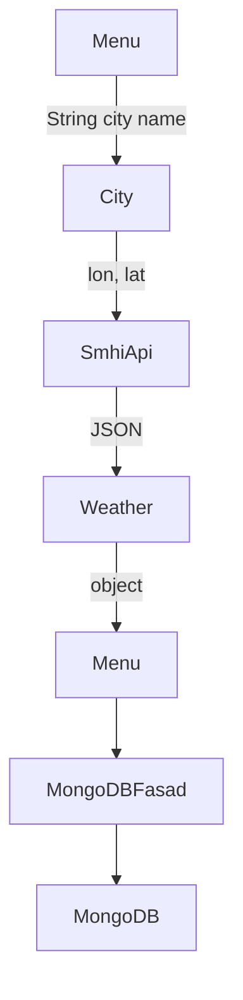
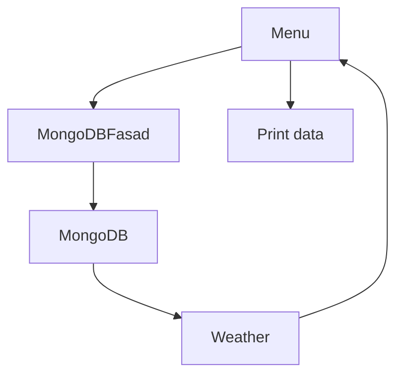
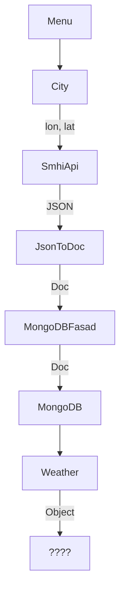

## Flowchart för interaktion mellan klasser

### Version 1.1 Save data
Two different approaches
note* City could use the Factory pattern

### Version 1.1 Display data
note* printing of data with separate class

### Legacy not how we will solve it 
